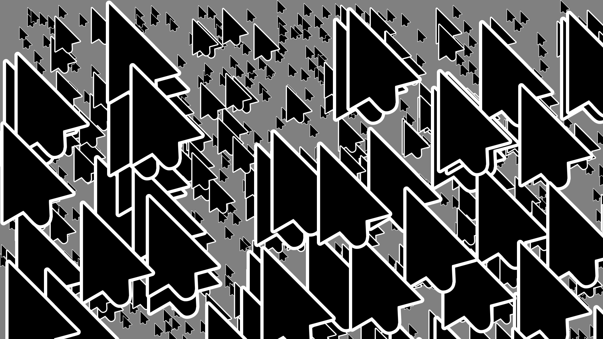

# random_cursor_image
generating random PNG images with randomly positioned cursors.


## dependencies

- `python>3.10`, `pillow`, `tqdm`


## usage

### run package directly

```bash
python3 -m random_cursor_image <IMAGE_SAVE_PATH>
python3 -m random_cursor_image -r <RANDOM_SEED> <IMAGE_SAVE_PATH>
```

### import it

```python
import random_cursor_image
random_seed = 19260817             # None for random
save_path = "path/to/png"          # must NOT be None
cursor_path = "path/to/cursor.png" # None for default
image_size = (1920, 1080)          # 1080p
random_cursor_image.random_cursor_image(random_seed, save_path, cursor_path, image_size)
```


## sample image


